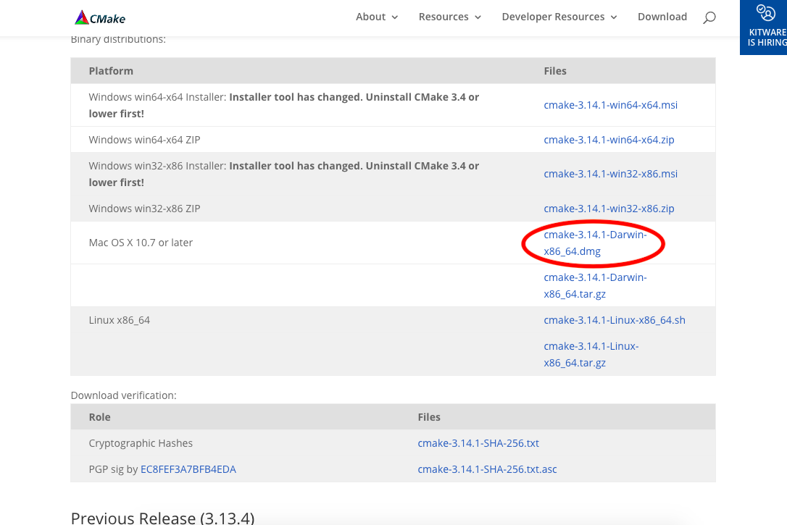
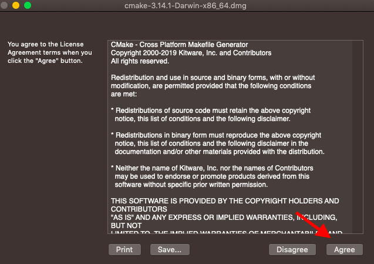
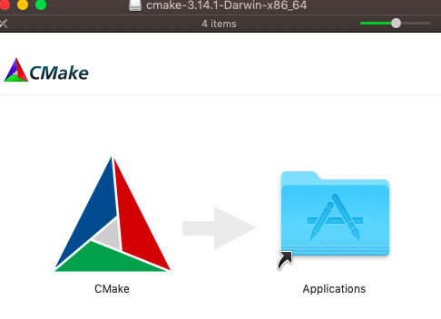
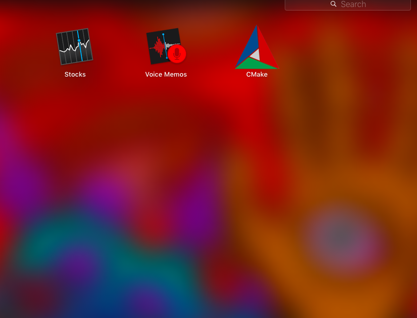
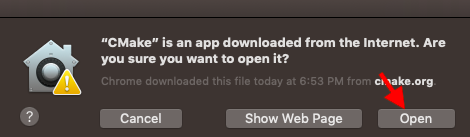
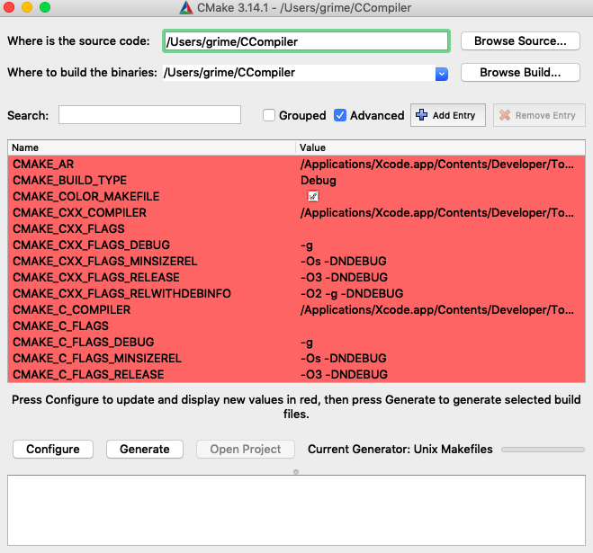
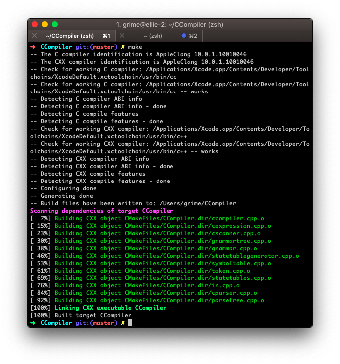

# CCompiler Design Document
------------------------------------
## Compilation:
This project uses [CMake](https://cmake.org/) to generate a makefile and compile.
Please install CMake and generate the CMakeFiles first.
Steps (for macOS) are shown below:

### Step 1


* Go to [cmake.org/download](https://cmake.org/download) and download cmake-3.x-Darwin-x86_64.dmg

### Step 2


* Open the downloaded .dmg file and click the agree button (if you agree to the terms)

### Step 3


* Drag the CMake app into your applications folder to install it

### Step 4


* Find CMake and open it



* Click "Open"

### Step 5


* Click "Browse Source..." and set it to this directory

* Click "Browse Build..." and set it to this directory

* Click "Configure"

* Click "Generate"

* The Makefile has now been generated!

### Step 6


* Navigate to this project via command line

* Type ``make`` -- you should see output similar to what is shown

* The executable has now been created and you are ready to run the compiler!


## Usage:
ccompiler - compile a C file
```
./ccompiler [FILE]

Optional arguments:
-h displays this help menu
-s displays list of tokens
-t displays the simple symbol table
-p displays parse tree
-r display the IR generated
-i [file] populate the IR from a file
-o [file] write the IR to a file
-w [file] write the assembly code out to a specified file. If this argument is not used, the compiler will automatically write to out.s
```

## Example Usage:
(assuming the file is test.c)

To print out a list of tokens:
```
./CCompiler -s test.c
```

To print out the internal symbol table:
```
./CCompiler -t test.c
```

To print out the parse tree:
```
./CCompiler -p test.c
```

To print out the internal intermediate representation:
```
./CCompiler -r test.c
```

These arguments can be used in combination. For example,
to print out the parse tree and IR, a user could use:
```
./CCompiler -rp test.c
```

### Testing and executing your C file:
After running ``CCompiler`` on your C file, the compiler
will output the corresponding assembly. By default, the
compiler will write this assembly to ``out.s``. In order to
execute it do the following:

```
➜  CCompiler git:(master) ✗ ./CCompiler test.c
accepted!
➜  CCompiler git:(master) ✗ gcc out.s
➜  CCompiler git:(master) ✗ ./a.out
➜  CCompiler git:(master) ✗ echo $?
```

The echoed value will be the return value of your program.

## Limitations:
* Cannot handle global variables
* Cannot handle functions with arguments.
* Cannot handle for loops
* Can only handle ints and chars (no floats)
* Postfix unary ops do not work (x++, x--, etc.)
* Variable declaration lists require that the first variable in the list is initialized
* Spaces are required after expressions (in lists only?) before the comma
* "Else if" statements do not work. They are are tokenized and parsed but not generated
in the IR. If statements and else statements do work
* Goto statements do not work (not generated in IR stage)
* Switch statements fail at IR stage.
* Embedded while loops may cause an infinite loop ¯\_(ツ)_/¯

## Code Standards:

### 1
Curly Braces ('{' and '}') will be placed on their own line. For example:
```
int main(int argc, char * const argv[])
{
    return 0;
}
```

### 2
Member variables will have a preceding "m\_" followed by CamelCase naming:
```
class Compiler
{
private:
    Scanner m_scanner;
    vector<Tok> m_tokenList;
```
...
etc.
